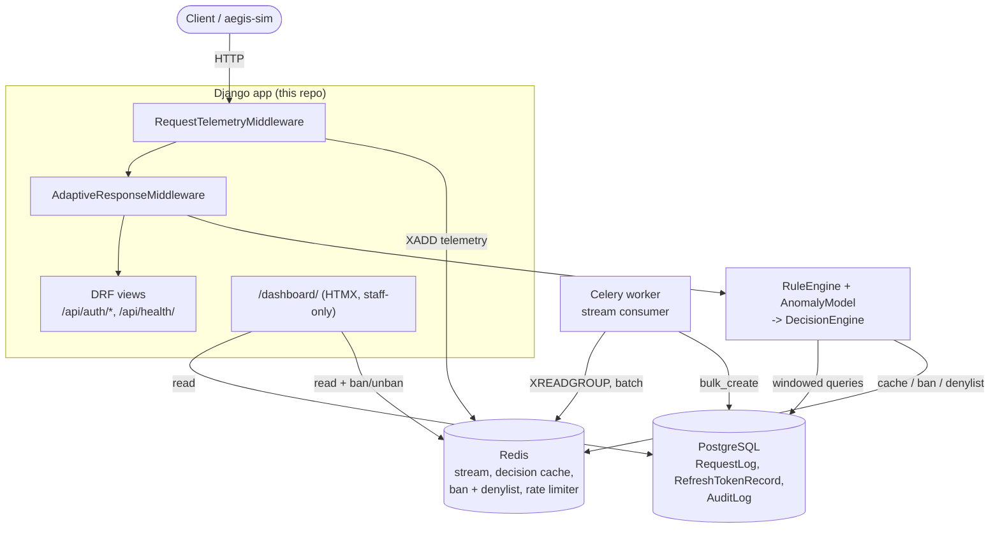
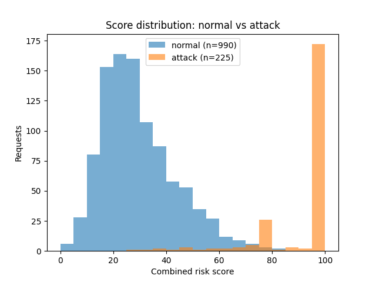
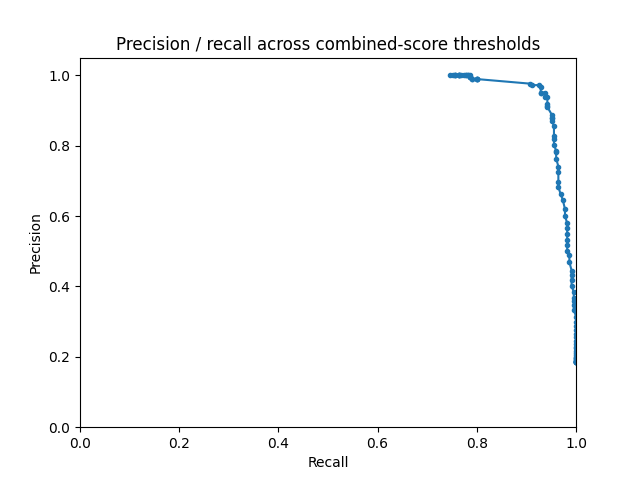
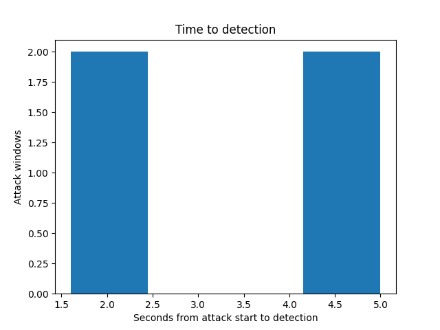

# Aegis

Aegis is an adaptive security layer for Django REST APIs. It collects request
telemetry, detects suspicious behaviour, calculates a risk score, and applies
an appropriate response.

## Contents

- [Development stack](#development-stack)
- [Architecture](#architecture)
- [Start locally](#start-locally)
- [Request telemetry](#request-telemetry)
- [Attack simulator (aegis-sim)](#attack-simulator-aegis-sim)
- [Labeled dataset generation](#labeled-dataset-generation)
- [Rule-based detection engine](#rule-based-detection-engine)
- [Rate limiting (token bucket, Redis + Lua)](#rate-limiting-token-bucket-redis--lua)
- [Feature extraction](#feature-extraction)
- [Anomaly model and combined risk score](#anomaly-model-and-combined-risk-score)
- [Threshold calibration](#threshold-calibration)
- [Adaptive response layer](#adaptive-response-layer)
- [Refresh token rotation and theft detection](#refresh-token-rotation-and-theft-detection)
- [Device binding and impossible travel](#device-binding-and-impossible-travel)
- [Tamper-evident audit log](#tamper-evident-audit-log)
- [Attack dashboard](#attack-dashboard)
- [Load testing and overhead](#load-testing-and-overhead)
- [Final evaluation](#final-evaluation)
- [Testing](#testing)
- [Continuous integration](#continuous-integration)
- [Connecting a real API (live demo)](#connecting-a-real-api-live-demo)

## Development stack

- Django and Django REST Framework
- PostgreSQL
- Redis
- Celery

## Architecture



Telemetry and detection are decoupled by the Redis Stream: the middleware
never blocks on Postgres, and a Celery worker drains the stream into
`RequestLog` in the background. `AdaptiveResponseMiddleware` reads that same
history live (through `RuleEngine`) plus a trained `AnomalyModel` to compute
a risk score per request, caching the result in Redis so most requests skip
the expensive path entirely. The dashboard is a read-only view over the same
Postgres/Redis state everything else already writes to -- no separate
aggregation pipeline.

## Start locally

```bash
cp .env.example .env && docker compose up --build
```

Then open `http://localhost:8000/api/health/`.

## Request telemetry

`RequestTelemetryMiddleware` publishes non-sensitive metadata to a bounded
Redis Stream. A Celery task consumes the stream in batches and persists it to
PostgreSQL. Messages are acknowledged only after storage, and unique stream
IDs make retries idempotent. If Redis is unavailable, telemetry fails open so
the protected API remains available.

Stored fields include path, query string, method, response status, duration,
client IP, user agent, authenticated user, and token JTI. Request bodies,
cookies, credentials, and raw tokens are deliberately excluded. The query
string *is* captured (added during threshold calibration, below) because the
rule engine's SQLi/XSS signatures need it -- those payloads travel in query
params, and without them stored, injection attempts were indistinguishable
from ordinary traffic once they were no longer live requests.

## Attack simulator (aegis-sim)

`aegis-sim/` is a standalone CLI, built on `httpx`, for generating authorized
traffic against an API you control. It ships four scenarios:

- `brute-force` — repeated login attempts with an incrementing password
- `scrape` — a bot paging sequentially through the product listing
- `id-enumeration` — sequential scanning of `/api/orders/{id}/`
- `injection-probes` — cycling SQLi and XSS payloads through a search param

Rate (`--rate`, req/s) and duration (`--duration`, seconds) are configurable
per run. `validate_target` refuses to run against a public hostname unless
`--allow-public-target` is passed explicitly, so it only targets local/private
infrastructure by default. Traffic generated by these scenarios is the labeled
"attack" half of the dataset used to train and evaluate the detection engine.

Run it locally:

```bash
cd aegis-sim
pip install -e .
aegis-sim brute-force --base-url http://127.0.0.1:8000 --rate 5 --duration 10
```

There is also a `normal-traffic` scenario: irregular GETs across health, product
listing, and order endpoints, meant to look like an ordinary user rather than
an attack. Its pacing can be randomized with `--jitter` (0-1) instead of
holding the fixed `--rate` cadence the attack scenarios use.

## Labeled dataset generation

`aegis-sim-dataset` (also in `aegis-sim/`) runs a full campaign against a
target: mostly `normal-traffic`, interrupted by short bursts of each attack
scenario, and writes a manifest of every window's start/end time and label.

```bash
aegis-sim-dataset --base-url http://127.0.0.1:8000 --hours 2 \
  --normal-share 0.85 --attack-burst-seconds 60 --output dataset_manifest.json
```

Once the campaign has run (and the Celery consumer has drained the request
stream into Postgres), label the `RequestLog` rows it produced and export them
to CSV with a Django management command:

```bash
python manage.py label_request_dataset --manifest dataset_manifest.json --output dataset.csv
```

Each output row carries the real request telemetry (path, method, status,
duration, IP, user agent, user id, jti) plus a `normal`/`attack` label and the
scenario name. This labeled CSV is the base dataset the detection engine
(Phase 3) will be trained and evaluated against.

## Rule-based detection engine

`aegis_rules.engine.RuleEngine` scores a request from 0-100 by combining four
rules, each graded rather than pass/fail:

- `injection_signature` — regex signatures for SQLi, XSS, and path traversal,
  checked inline against the current request's path and query params
- `unauthorized_attempts` — count of 401s from the same IP in a trailing
  window (default 5 minutes)
- `not_found_rate` — share of that IP's recent requests returning 404
  (endpoint scraping/enumeration)
- `sequential_id_scan` — longest run of consecutive resource IDs the IP has
  walked (e.g. `/api/orders/7/`, `/8/`, `/9/`)

The windowed rules query `RequestLog` directly — the `(ip_address,
created_at)` and `(status_code, created_at)` indexes added alongside the
telemetry model exist for exactly this. Scores are summed and capped at 100,
so multiple weak signals on one request outrank a single one:

```python
from aegis_rules.engine import RuleEngine

result = RuleEngine().evaluate(
    ip_address=request.META.get("REMOTE_ADDR"),
    path=request.path,
    query_params=request.GET,
)
result.score            # 0-100
result.triggered_rules  # which rules fired, and why
```

This engine isn't wired into the request/response cycle yet — that lands with
the adaptive response layer in Phase 4. For now it's a tested, standalone
scorer that Phase 3's model-based risk score will later be blended with.

## Rate limiting (token bucket, Redis + Lua)

`aegis_core.rate_limiter.TokenBucketRateLimiter` implements a token bucket by
hand as a Redis Lua script ([`token_bucket.lua`](aegis_core/scripts/token_bucket.lua)),
not a ready-made rate-limiting package. The read-refill-decrement-write
sequence runs as one atomic `EVAL`, so two concurrent requests against the
same key can't both read a stale token count and both get let through — a
plain Python read-then-write against Redis would race here.

`bucket_params_for_score` ties the bucket's size and refill rate to the rule
engine's risk score: at score 0 a client gets the full configured rate; as
the score climbs toward 100 both shrink toward a configured minimum, so a
suspicious client is throttled harder without a separate code path.

```python
from aegis_core.rate_limiter import TokenBucketRateLimiter

limiter = TokenBucketRateLimiter()
decision = limiter.check_for_risk_score(f"ip:{client_ip}", risk_score)
decision.allowed            # bool
decision.remaining_tokens   # tokens left in the bucket
```

Like request telemetry, this is fail-open: if Redis is unreachable, `check()`
logs a warning and allows the request rather than taking the API down.
Defaults (`AEGIS_RATE_LIMIT_BASE_CAPACITY`, `_BASE_REFILL_PER_SECOND`,
`_MIN_CAPACITY`, `_MIN_REFILL_PER_SECOND`) are environment-configurable, same
pattern as the request-stream settings above.

The Lua script's atomicity is only meaningful against a real Redis — the test
suite includes a live test class (`TokenBucketRateLimiterLiveTests`) that
fires 20 concurrent requests at a 5-token bucket and asserts exactly 5 get
through; it skips itself automatically when Redis isn't reachable.

## Feature extraction

`aegis_ml.features.extract_features(ip_address, now)` turns one IP's recent
`RequestLog` history into the numeric feature vector the anomaly model
(Phase 3, next) will train and score on. It computes, over trailing 1, 5, and
60 minute windows (keys prefixed `w1m_`, `w5m_`, `w60m_`):

- `request_count` / `request_rate_per_second`
- `unique_endpoints` — distinct endpoints, with numeric IDs collapsed via
  `aegis_core.paths.normalize_path` so `/orders/7/` and `/orders/8/` count as
  one endpoint, not two
- `error_ratio` — share of responses with status >= 400
- `mean_interval_seconds` / `stdev_interval_seconds` / `interval_entropy` —
  timing between consecutive requests; a bot hitting at a near-constant rate
  has low entropy, irregular human pacing has higher entropy
- `method_get_ratio` / `method_post_ratio` / `method_other_ratio`
- `unique_user_agents`

A cyclical `hour_sin`/`hour_cos` pair (rather than a raw 0-23 integer) is
added once per vector, so hour 23 and hour 0 read as adjacent to a
distance-based model instead of maximally far apart.

```python
from aegis_ml.features import extract_features

extract_features("203.0.113.10")  # -> {"w1m_request_count": 3, ..., "hour_sin": 0.71, ...}
```

## Anomaly model and combined risk score

Train an Isolation Forest (and a One-Class SVM for comparison) on the
`normal`-labeled rows of a `label_request_dataset` CSV:

```bash
python manage.py train_anomaly_models --dataset dataset.csv --output-dir models/
```

This recomputes each labeled row's feature vector at its own timestamp
(`aegis_ml.training.load_training_samples`), fits both estimators on the
`normal` rows only, and saves each as an `AnomalyModel`
(`aegis_ml/model.py`) — the fitted estimator plus a `ScoreCalibration` that
maps its raw `decision_function` output to 0-100 using the 1st/99th
percentiles of that output over the training set. It also prints a quick
comparison of both models' mean scores and flag counts on the full dataset,
as a sanity check before either is trusted — full precision/recall
calibration is a later, separate step.

`aegis_ml.risk.combined_risk_score(rule_score, model_score, rule_weight=0.5)`
blends the rule engine's score (Day 7-8) with the model's score into the
final 0-100 risk score, as the roadmap specifies. Like the rule engine and
rate limiter, none of this is wired into live request handling yet.

## Threshold calibration

`aegis_ml.calibration` replays a labeled dataset through both halves of the
final score -- the rule engine (recomputed live from that IP's stored
`RequestLog` history, same as production) and a trained `AnomalyModel` -- and
sweeps thresholds on the combined score to find the one with the best recall
that still keeps the false-positive rate under a target (3% by default, per
the roadmap):

```bash
python manage.py calibrate_thresholds \
  --dataset dataset.csv --model models/isolation_forest.joblib \
  --max-fpr 0.03 --curve-output pr_curve.png --report-output calibration_report.json
```

This plots the precision/recall curve to `pr_curve.png` and writes
`calibration_report.json` with the chosen threshold's precision/recall/F1/FPR
and up to 20 false positives and false negatives each (IP, path, timestamp,
scenario, both sub-scores) for actually inspecting what got misclassified,
not just counting it.

Building this surfaced a real gap: request telemetry stored `path` but never
the query string, so a SQLi/XSS payload sent as `?search=...` was
indistinguishable from ordinary traffic once it was no longer a live
request -- the signature rule had nothing to match against on replay. Fixed
by adding `RequestLog.query_string` (migration `0004`) and publishing it from
the middleware; `label_request_dataset` now exports it too, and calibration
decodes it back into query params before handing it to the rule engine.

## Adaptive response layer

This is where the rule engine, anomaly model, and rate limiter -- built and
tested independently through Phase 3 -- actually connect to live request
handling, via `aegis_ml.middleware.AdaptiveResponseMiddleware`.

Per request it computes a `Decision` (`aegis_ml/decision.py`): the rule
engine's score plus the anomaly model's score (loaded once from
`AEGIS_ANOMALY_MODEL_PATH`, falling back to rules-only scoring if no model
has been trained yet). With a loaded model the scores are blended by
`AEGIS_RULE_WEIGHT`; without one, the rule score keeps its full weight and
unused feature extraction is skipped. The result is classified into
the roadmap's four tiers:

| Score | Tier | Response |
|---|---|---|
| 0-30 | normal | pass through; still subject to the token-bucket rate limit |
| 30-60 | suspicious | same, but the bucket has already shrunk (Day 9's continuous scaling) |
| 60-80 | risky | `403 challenge_required` (a hook for real CAPTCHA/2FA -- not built) |
| 80-100 | attack | `403 temporarily_blocked`, IP banned for `AEGIS_BAN_DURATION_SECONDS` |

Rule evaluation hits Postgres and model scoring runs a scikit-learn
estimator, both too slow to redo on every request from the same client, so
the decision is cached in Redis for `AEGIS_DECISION_CACHE_TTL_SECONDS`
(default 5s) and reused only when the path, complete query parameters, user,
and device fingerprints match. Each IP retains just one entry with a digest
of that context; changed inputs are scored immediately, and raw request
context is not copied into the cache. A confirmed attack verdict is
remembered separately and much longer (`AEGIS_BAN_DURATION_SECONDS`, default
300s) as a ban flag, so a banned IP is rejected on a plain Redis key check --
no rule/model recomputation at all.

**Shadow mode** (`AEGIS_SHADOW_MODE`, default `true`) computes and logs every
decision but never blocks a request -- the safe way to watch this layer
against real traffic before trusting it to affect responses. Token
revocation for the attack tier is a placeholder for now; it needs the
refresh-token infrastructure from Day 17.

The middleware sits *after* `RequestTelemetryMiddleware` in `MIDDLEWARE`, so
even a blocked request is still logged with its real status code (403/429).

## Refresh token rotation and theft detection

`POST /api/auth/login/` (username/password) and `POST /api/auth/refresh/`
issue JWT pairs via `djangorestframework-simplejwt`, but rotation and reuse
detection are hand-built (`aegis_core/tokens.py`), not SimpleJWT's own
blacklist app -- that tracks individual used tokens but has no concept of a
*family*.

Every refresh token is single-use, tracked in `RefreshTokenRecord`
(`jti`, `family_id`, `used_at`, `revoked_at`). Redeeming one:
1. issues a new refresh + access pair sharing the same `family_id`, and
2. marks the old one `used_at`.

Presenting an already-used refresh token -- the signature of a stolen token
being replayed -- revokes every outstanding token in that family at once,
`used` or not, denies its `jti`, and returns `401 token_reuse_detected`.
`family_id` is copied onto the access token too (SimpleJWT copies custom
refresh claims onto `refresh.access_token` automatically), so
`FamilyAwareJWTAuthentication` (`aegis_core/authentication.py`) can reject an
already-issued access token from a revoked family immediately, rather than
waiting out its short natural expiry.

Denial is checked in two places, matching the fast-Redis/durable-database
split used everywhere else in this project: `RefreshTokenRecord` is
authoritative, Redis (`aegis:denylist:jti:*`, `aegis:denylist:family:*`) is a
cache in front of it that `is_family_revoked` falls back off of -- rather
than failing open -- when unavailable, since this check is a security
boundary, not just an availability nicety.

`RequestTelemetryMiddleware`'s existing `token_jti` field (Day 2) needed no
changes: DRF's `Request.auth` setter writes through to the underlying
`HttpRequest`, so the access token's claims are already visible to
telemetry, which runs after the view in the middleware chain.

## Device binding and impossible travel

Two more rules feed into the same `RuleEngine` (Day 7-8), scoring context
that only exists once a client is authenticated:

- **`device_fingerprint_rule`** -- `aegis_core.fingerprint.compute_fingerprint`
  hashes User-Agent/Accept-Language/Accept-Encoding into a per-device
  fingerprint (deliberately excluding IP, which is expected to change).
  `LoginView` binds it to the token family (`RefreshTokenRecord.fingerprint`,
  carried forward unchanged through every rotation -- see Day 17). A request
  whose live fingerprint doesn't match its token's bound one scores 60.
- **`impossible_travel_rule`** -- grouped by authenticated user, not IP
  (impossible travel is defined *by* an IP changing). Looks up that user's
  most recent request from a *different* IP within a trailing window,
  geolocates both IPs (`aegis_core.geoip`, a MaxMind GeoLite2 `.mmdb` file
  at `AEGIS_GEOIP_DB_PATH` -- unset by default, in which case this rule
  always scores 0), and scores the implied speed between them against a
  configurable plausibility ceiling (900 km/h by default).

Both need input `AdaptiveResponseMiddleware` didn't have before: which user
a request claims to be, and its token's bound fingerprint. Neither is available
yet when the middleware runs -- authentication happens later, inside the
view. So the middleware takes a best-effort, unauthenticated peek at the
Authorization header (`aegis_core.tokens.peek_access_token`) purely to feed
these two risk signals; it never grants access on the strength of that peek
-- enforcement is still entirely `FamilyAwareJWTAuthentication`'s job.

## Tamper-evident audit log

`aegis_core.audit.record_event(event_type, payload)` appends one row to
`AuditLog`. Each row embeds the previous row's `hash` as its own
`previous_hash` before hashing its own content
(`event_type` + `payload` + `created_at` + `previous_hash`, canonical JSON,
SHA-256) -- so altering or deleting any past row breaks every hash after it.
The first row chains off a well-known genesis hash (64 zeros). Writing is
wrapped in `transaction.atomic()` with `select_for_update()` on the current
tail row, so two concurrent events can't both read the same "previous" hash
and fork the chain.

```bash
python manage.py verify_audit_log
```

Walks the chain in order, re-deriving and re-linking every hash. On the
first row that doesn't fit -- its `previous_hash` doesn't match the prior
row's `hash` (a row was inserted, deleted, or reordered), or its stored
`hash` doesn't match what its own content recomputes to (a row was edited
in place) -- it reports that row's id, event type, and timestamp as the
exact point of tampering, and exits non-zero.

Two real call sites feed it, both already built:

- `token_family_revoked` -- from `_revoke_family` (Day 17), whenever
  refresh-token reuse or an unknown token triggers theft detection.
- `attack_blocked` -- from `AdaptiveResponseMiddleware._enforce` (Day 15-16),
  whenever the attack tier actually bans an IP (not in shadow mode).

The Django admin registers `AuditLog` read-only with delete disabled --
deleting a row through the admin would be exactly the tampering this log
exists to catch, so the only way to "remove" one is to leave evidence that
`verify_audit_log` will find.

## Attack dashboard

A staff-only Django + HTMX dashboard at `/dashboard/` (gated by
`@staff_member_required`, so it reuses the same session login as
`/admin/`), built on `dashboard/metrics.py`:

- **Request volume** -- an inline-SVG-free bar chart, one bar per minute
  over a trailing window, zero-filled so a quiet stretch reads as "quiet"
  rather than "no data".
- **High-risk IPs** -- the busiest IPs in the window (capped, since this
  scores each one live through `RuleEngine`, not from anything
  pre-aggregated), sorted by score, each with which rules it tripped and
  a Ban/Unban button.
- **Attack type breakdown** -- read off that same evaluation pass at no
  extra query cost: how many of those risky IPs tripped each rule
  (`unauthorized_attempts`, `sequential_id_scan`, `impossible_travel`, ...)
  is a reasonable proxy for "what kind of attack", without inventing a
  taxonomy the rule engine doesn't already have.
- **Recent events** -- the last N rows of Day 19's `AuditLog`.

Each panel is its own HTMX-polled partial (`hx-trigger="every Ns"`) so the
page refreshes itself without a full reload. Ban/Unban post to
`aegis_ml.decision.DecisionEngine.ban`/`.unban` (new this day: `unban` didn't
exist before, since nothing needed to *reverse* a ban) and record a
`manual_ban`/`manual_unban` event to the same audit log the automatic
`attack_blocked` path writes to -- a human overriding the system is exactly
the kind of thing that log exists to remember.

## Load testing and overhead

`AEGIS_ENABLED` (env var, default `true`) compiles `RequestTelemetryMiddleware`
and `AdaptiveResponseMiddleware` out of `MIDDLEWARE` entirely when false --
same app, same views, Aegis's own per-request cost isolated to on/off.
`loadtest/measure_overhead.py` uses it to answer the roadmap's Day 21
question directly: starts the server twice (once per setting), drives each
with a headless Locust run (`loadtest/locustfile.py`, hitting `/api/health/`
-- the one endpoint that exists in this repo and passes through the full
middleware stack; Aegis protects other people's business endpoints, not
itself), and diffs average response time into an overhead percentage against
a configurable budget (5% by default, per the roadmap), exiting non-zero if
it's exceeded.

```bash
pip install -r loadtest/requirements.txt
python loadtest/measure_overhead.py --users 50 --duration 30
```

Needs a real database and Redis reachable via whatever `DJANGO_SETTINGS_MODULE`
is already configured -- run it against the `docker compose` stack (or
`docker compose exec web python loadtest/measure_overhead.py`) for numbers
that mean anything.

**I could not get a trustworthy number in this sandbox** (no Docker here,
so no real Postgres or Redis) and want to say so plainly rather than publish
a fabricated pass. Two things I tried both turned out to measure the test
environment, not Aegis:

- Against an *unreachable* Redis, every request pays the fail-open path's
  connection-timeout cost on every attempt (no caching benefit ever kicks
  in) -- measured "overhead" was 900%+, an artifact of nothing being there
  to answer, not of Aegis's own logic.
- Substituting `fakeredis`'s TCP server got further (one clean low-concurrency
  run actually showed the decision cache paying off: aegis-on *faster* on
  average than off, -16.7%), but at higher concurrency it started returning
  corrupted RESP protocol responses outright -- a pure-Python Redis
  substitute isn't a sound stand-in for latency measurement, and I stopped
  trusting anything it produced, favorable or not.

So: the harness is real and ready to run; the number in this README isn't,
because I don't have the infrastructure to earn one honestly right now. If
you run it against the real stack and it comes in over budget, the first
places I'd look are `DecisionEngine`'s two Redis round trips per cache-miss
request and the rule engine's per-rule `RequestLog` queries (Day 7-8's
`(ip_address, created_at)` / `(status_code, created_at)` indexes should keep
those cheap, but worth confirming against `EXPLAIN ANALYZE` before assuming).

## Final evaluation

```bash
python manage.py evaluation_report \
  --dataset dataset.csv --manifest dataset_manifest.json \
  --model models/isolation_forest.joblib --threshold <from calibrate_thresholds> \
  --score-dist-output score_distribution.png --latency-output detection_latency.png
```

Reuses Day 14's `build_evaluation_samples`/`metrics_at_threshold` for the
headline numbers, and adds one thing Day 14 didn't compute: mean time to
detection. For every attack window in the campaign manifest,
`compute_detection_latencies` (`aegis_ml/evaluation.py`) finds the first
request inside it whose combined score reaches the detection threshold and
measures the gap from the window's start; `mean_time_to_detection` averages
that across every window that was ever caught, and separately counts the
ones that never were. Two charts get saved alongside the PR curve: a
normal-vs-attack score-distribution histogram (does the model actually
separate the two, visually) and a time-to-detection histogram.

**Numbers below are from a locally-generated demonstration run, not a real
`docker compose` deployment** -- Docker wasn't available for this session
(see Load testing, above, for the same caveat). I generated ~55 minutes of
synthetic traffic directly against `RequestLog` (990 normal requests across
30 IPs, plus four back-to-back attack bursts -- brute-force, scrape,
id-enumeration, injection-probes -- 225 requests total, `seed_evaluation_demo.py`-style,
not committed since it's a one-off demo generator, not part of the app),
trained both models on it, calibrated a threshold the same way Day 14 does,
and ran this command for real. The pipeline is exercised end-to-end and the
numbers are real outputs of real code -- just not from production-shaped
traffic, so treat them as "the tooling works, and roughly what a clean
separation looks like," not as a benchmark to cite.

| Metric | Value |
|---|---|
| Precision | 0.89 |
| Recall | 0.95 |
| F1 | 0.92 |
| False positive rate | 2.7% |
| Mean time to detection | 3.3s (4/4 attack windows caught) |





Re-run this against a real `aegis-sim-dataset` campaign (Day 6) over a real
deployment for numbers worth citing in an actual writeup.

## Testing

```bash
pip install -r requirements-dev.txt
pip install -e aegis-sim   # pytest also picks up aegis-sim/tests/ from the repo root
pytest              # everything
pytest aegis_rules aegis_core   # just the rule engine and token rotation
```

The whole suite (Django `TestCase`-based, run via `pytest`/`pytest-django`
rather than `manage.py test`) needs a real Postgres and Redis reachable via
`DJANGO_SETTINGS_MODULE=config.settings`'s env vars — run it inside
`docker compose` (`docker compose exec web pytest`), or point
`DJANGO_SETTINGS_MODULE` at a settings module with a local database for a
quick check without the full stack. The live Redis-atomicity tests
(`TokenBucketRateLimiterLiveTests`) and any test that needs a real Redis
skip themselves automatically when one isn't reachable.

Switching test runners caught a real bug in the test suite itself:
`pytest-django` refuses database access from a test that isn't declared as
using it, and `DecisionEngineTests` was a plain `unittest.TestCase` calling
`RuleEngine.evaluate()` (which queries `RequestLog`, even against an empty
table) without Django's `TestCase` wrapping it in a per-test transaction.
`manage.py test` never enforced that boundary, so it silently worked without
the isolation Django's `TestCase` provides. Fixed by making it a proper
Django `TestCase`; `pytest.ini`'s `--reuse-db` keeps re-runs fast locally.

## Continuous integration

`.github/workflows/ci.yml` runs on every push to `main` and every pull
request: spins up Postgres and Redis as service containers (matching the
real stack, not a local sqlite substitute), installs `aegis-sim` in editable
mode, runs migrations, then `pytest -v` -- one command for the whole repo,
since pytest, run from the root, picks up `aegis-sim/tests/` and
`loadtest/test_measure_overhead.py` alongside every Django app's `tests.py`
without needing a separate invocation for each.

## Connecting a real API (live demo)

The roadmap's original plan was to run Aegis's live demo in front of a
separate `Django-Marketplace-API` project. **That project isn't part of this
session** — I don't have access to it, so nothing below has actually been
wired up against it; this is a guide for doing that, not a record that it's
done.

Two ways to connect them, depending on how separate you want to keep them:

**Option A — merge Aegis into the Marketplace project** (simplest, what this
repo already assumes structurally): add `aegis_core`, `aegis_rules`,
`aegis_ml`, and `dashboard` to the Marketplace project's `INSTALLED_APPS`;
copy `AdaptiveResponseMiddleware` and `RequestTelemetryMiddleware` into its
`MIDDLEWARE` (after its own auth/session middleware, before
`MessageMiddleware` — see [Architecture](#architecture)); point its
`REST_FRAMEWORK.DEFAULT_AUTHENTICATION_CLASSES` at
`aegis_core.authentication.FamilyAwareJWTAuthentication`; run
`python manage.py migrate` there so `RequestLog`/`RefreshTokenRecord`/
`AuditLog` exist. The Marketplace API's own login view would call
`aegis_core.tokens.issue_initial_pair` instead of issuing bare SimpleJWT
tokens, to get rotation and theft detection.

**Option B — keep them as separate deployments sharing infrastructure**: run
both Django projects against the *same* Postgres and Redis (different
databases/key prefixes), so `RequestLog` and the decision cache stay
centralized in Aegis's database while the Marketplace API only carries
`AdaptiveResponseMiddleware` + `RequestTelemetryMiddleware` in its own
`MIDDLEWARE` pointed at that shared Postgres/Redis via `DJANGO_SETTINGS_MODULE`
env vars. This keeps Aegis's dashboard and audit log as the single place
security state lives across multiple protected APIs, at the cost of a
network hop for every telemetry write and decision cache lookup.

Either way, `aegis-sim --base-url` and `aegis-sim-dataset --base-url` just
need to point at wherever the Marketplace API actually listens; nothing
about traffic generation or dataset labeling assumes the API lives in this
repo.
